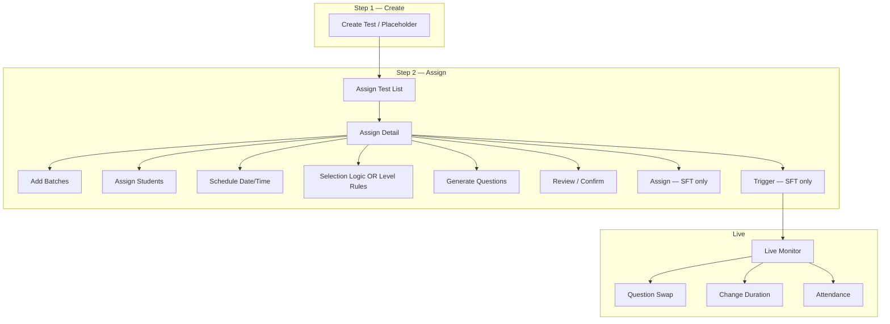

# New Test Flow — Mock Application Documentation

Interactive UI mock for the LMS **New Test Flow**. Built with React 18, Vite, TypeScript, Bootstrap 5, react-bootstrap, and MUI (filters only).

```bash
npm install
npm run dev      # development
npm run build    # production build
```

---

## Table of Contents

1. [High-Level Flow](#1-high-level-flow)
2. [Routes & Navigation](#2-routes--navigation)
3. [Pages](#3-pages)
4. [Shared Components](#4-shared-components)
5. [Assign Detail Sub-Components](#5-assign-detail-sub-components)
6. [Modals](#6-modals)
7. [Data Models (Types)](#7-data-models-types)
8. [Constants & Mock Data](#8-constants--mock-data)
9. [Utilities](#9-utilities)
10. [Test Type Behaviour Matrix](#10-test-type-behaviour-matrix)
11. [Demo Paths](#11-demo-paths)

---

## 1. High-Level Flow



| Phase | Purpose |
|-------|---------|
| **Create** | Define test metadata (or course placeholder for Subject Final Test). |
| **Assign** | Add batches, students, schedule, configure/generate questions, confirm set. |
| **Live** | Monitor in-progress tests; swap questions, change duration, mark attendance. |

**Weekly / Revision tests** use **manual selection logic** (subject → topics → subtopics → MCQ/Coding counts).

**Subject Final Test (SFT)** uses **auto level rules** at assign time, separate **Assign** then **Trigger** steps, and student eligibility rules.

| `/test-reports` | TestReportsScreen | Auto reports + grade bands + email mock |
| `/trainer-performance` | TrainerPerformanceScreen | Generation limit + unused tracking |
| `/course-config` | CourseConfigScreen | Course placeholders (no questions until assign) |

---

## Subject Final / Overall Final Test — Spec Implementation (Mock)

| Email / Kannan requirement | Implemented |
|----------------------------|-------------|
| Course placeholder only at config | `/course-config`, Create → Add Placeholder |
| Configure + generate at assign | Level rules + Generate on assign detail |
| Assign before Trigger | **Assign** then **Trigger** buttons |
| FT001, FT002 sequential naming | `sessionStorage` sequence on first generate |
| Subject completed gate | `subjectCompleted` on test mock |
| Non-editable system name | Badge + no edit icon |
| No assign to absent / auto-absent 25% | `absent`, `autoAbsent25` student flags |
| One final per subject per student | `finalTestCompletedSubjects` |
| Question repeat fallback | `sftGeneration.ts` with reorder/shuffle warning |
| Flag question + notify roles | `FlagQuestionModal` |
| Disable if unused / show usage if used | `questionFlagData.ts` |
| Triggered list (scheduled + trigger times) | `/triggered-tests` |
| Completed details | `/completed-tests` |
| Reports + SUN/MOON/STAR/REST | `/test-reports` |
| Email reports (discussed) | Toggle + Send mock |
| Trigger/generation limit (10) | `FINAL_TEST_GENERATE_LIMIT` + alerts |
| Trainer performance (unused generates) | `/trainer-performance` |
| Overall Final Test same logic | `/assign-test/OT-12M-002` |
| Disable assign/trigger after all attempted | `allAssignedStudentsAttemptedFinal()` |
| Delete unused tests | N/A per Kannan — not implemented (by design) |

**Demo:** `/assign-test/FT001` or `/assign-test/OT-12M-002` → batch → students → schedule → Generate → Confirm → Assign → Trigger → Complete → Reports.

---

## 2. Routes & Navigation

### App routes (`src/App.tsx`)

| Route | Screen | Description |
|-------|--------|-------------|
| `/` | OverviewScreen | Feature map / dashboard |
| `/create-test` | CreateTestScreen | Step 1 — create test metadata |
| `/assign-test` | AssignTestListScreen | Step 2 — test list |
| `/assign-test/:testId` | AssignTestScreen | Step 2 — assign detail |
| `/level-rules` | LevelRulesScreen | Configure level rules (SFT) |
| `/time-question-sets` | TimeQuestionSetsScreen | Time-slot question sets demo |
| `/live-monitor` | LiveMonitorScreen | Live test dashboard |
| `/question-swap` | QuestionSwapScreen | Swap question for one student |
| `/change-duration` | ChangeDurationScreen | Extend/reduce live duration |
| `/attendance` | AttendanceScreen | 25% attendance window |
| `/triggered-tests` | TriggeredTestsScreen | Assigned / triggered list (SFT) |
| `/completed-tests` | CompletedTestsScreen | Post-completion details (SFT) |

### Sidebar (`MockLayout.tsx`)

| Item | Path |
|------|------|
| Dashboard | `/` |
| Create | `/create-test` |
| Assign | `/assign-test` |
| Triggered | `/triggered-tests` |
| Completed | `/completed-tests` |
| Level Rules | `/level-rules` |
| Question Sets | `/time-question-sets` |
| Live Monitor | `/live-monitor` |

### Top tabs (`TestPageShell.tsx`)

| Tab | Active when path includes |
|-----|---------------------------|
| Create | `/`, `/create-test` |
| Assign | `/assign-test`, `/level-rules`, `/time-question-sets` |
| Live | `/live-monitor`, `/question-swap`, `/change-duration`, `/attendance` |

---

## 3. Pages

### 3.1 Overview (`OverviewScreen.tsx`) — `/`

**Purpose:** Landing page listing all mock features with links.

| UI element | Description |
|------------|-------------|
| Feature cards | One card per feature (title, step badge, tag badge, description, route links) |
| Step badge | `1–2`, `2`, or `Live` |
| Tag badge | `Core`, `Assign`, or `Live` |
| Route links | Clickable paths to related screens |

**Features listed:** Two-Step Flow, Level-wise Rules, Time-based Question Sets, Question Swap, Change Duration, Attendance Relaxation.

---

### 3.2 Create Test (`CreateTestScreen.tsx`) — `/create-test`

**Purpose:** Step 1 — create test metadata. For **Subject Final Test**, only adds a **course placeholder** (no question config here).

#### Form fields

| Field | Control | Required | Options / behaviour |
|-------|---------|----------|---------------------|
| **Select 'Track'** | `Form.Select` | Yes | IT, Aptitude, Full Stack, Data Science |
| **Select Course** | `MultiSelect` | Yes | Courses for selected track; multi-select supported |
| **Select 'Subject'** | `Form.Select` | Yes | SQL, Python, DSA, SQL-Python-DSA, All, Java, JavaScript |
| **Select 'Type'** | `Form.Select` | Yes | Weekly Test, Revision Test, Practice Test, Subject Final Test, Overall Test, Employability Test |

#### Preview block

| Element | Description |
|---------|-------------|
| Auto-generated test name | Preview from `buildTestName()` |
| SFT placeholder note | Shows `FT###`; explains numbering at first assign |
| Non-editable note (SFT) | Questions applied only at assign; name not editable |

#### Actions

| Button | Behaviour |
|--------|-----------|
| **Create Test** | Shown for non-SFT types; navigates to `/assign-test` after mock delay |
| **Add Placeholder to Course** | Shown for Subject Final Test; same navigation |

#### Naming convention (`createTestConstants.ts`)

| Type | Pattern | Example |
|------|---------|---------|
| Weekly Test | `{Subject}  - {Course} - WT{seq}` | `SQL  - 12M 2026 - WT001` |
| Revision Test | `{Subject}  - {Course} - RT{seq}` | `SQL  - 12M 2026 - RT001` |
| Subject Final Test | `{Subject}  - {Course} - FT{seq}` | `SQL  - 12M 2026 - FT001` |
| Practice Test | `PT - {Course} - {seq} - {Subject}` | `PT - 12M 2026 - 001 - SQL-Python-DSA` |
| Overall Test | `OT - {Course} - {seq} - {Subject}` | `OT - 12M 2026 - 001 - SQL-Python-DSA` |
| Employability Test | `ET - {Period} - {seq} - {Subject}` | `ET - May 2026 - 001 - SQL-Python-DSA` |

---

### 3.3 Assign Test List (`AssignTestListScreen.tsx`) — `/assign-test`

**Purpose:** Lists all tests; filter and open assign detail.

#### Summary badges

| Badge | Value |
|-------|-------|
| Unassigned | Count of tests with `status: "unassigned"` |
| Assigned / Partial | Count of `assigned` + `partial` |

#### Filter panel (left)

| Field | Control | Options |
|-------|---------|---------|
| **Track** | `TestFilterSelect` | All Tracks, IT, Aptitude, Full Stack, Data Science |
| **Test Type** | `TestFilterSelect` | All Types + each `CREATE_TEST_TYPES` entry |
| **Status** | `TestFilterSelect` | All Tests, Unassigned, Assigned, Partially Assigned |
| **Clear Filters** | Button | Resets all filters |

#### Search (header)

| Field | Control | Notes |
|-------|---------|-------|
| Search tests… | `input` in `TestPageShell` | UI only; not wired to filter in mock |

#### Test card (each row)

| Element | Source field | Description |
|---------|--------------|-------------|
| Test name | `test.name` | Bold title |
| Status badge | `test.status` | Unassigned / Partially Assigned / Assigned |
| Subject | `test.subject` | With list icon |
| Duration | `test.duration` | Minutes |
| Marks | `test.marks` | Total marks |
| Schedule | `test.date`, `test.time` | Via `TestCardSchedule` (if set) |
| Batch | `test.batch`, `test.course` | Shown if assigned |
| Assigned count | `test.assignedCount` | Student count |
| Remaining count | `test.remainingCount` | Students not yet assigned |
| Description | `test.description` | Free text |
| Action button | — | **Assign** / **Assign Remaining** / **Re-assign / View** |

**Click behaviour:** Card or button navigates to `/assign-test/{test.id}`.

#### Mock test IDs

| ID | Type | Status |
|----|------|--------|
| `PT-12M-001` | Practice Test | Assigned (2 batches, same schedule) |
| `RT001` | Revision Test | Unassigned |
| `PT-12M-002` | Practice Test | Unassigned |
| `FT001` | Subject Final Test | Unassigned |
| `OT-12M-001` | Overall Test | Assigned |
| `ET-MAY-001` | Employability Test | Unassigned |

---

### 3.4 Assign Test Detail (`AssignTestScreen.tsx`) — `/assign-test/:testId`

**Purpose:** Configure assignment for one test — batches, students, schedule, questions, security.

#### Header

| Element | Field / behaviour |
|---------|-------------------|
| Back button | → `/assign-test` |
| Test name | `test.name` |
| Edit icon | Hidden for Subject Final Test |
| System name badge | SFT only — "not editable" |
| Subject | `test.subject` |
| Duration | `test.duration` minutes |
| Marks | `test.marks` |
| Description | `test.description` |
| Subject not complete warning | SFT when `subjectCompleted === false` |
| Selection logic row | Weekly types only — journal icon + saved badge |

#### Add batch row

| Field | Control | Behaviour |
|-------|---------|-----------|
| **Track** | `TestFilterSelect` | IT, Aptitude, Full Stack |
| **Course** | `TestFilterSelect` | Courses for track |
| **Batch** | `TestFilterSelect` | Batches for course; excludes already added |
| **Add Batch** | Button | Disabled for SFT if subject not completed |

#### Schedule group box (`ScheduleGroupBox`)

Batches with the **same date + time** share one question set.

| Header element | Description |
|----------------|-------------|
| Expand/collapse | Chevron toggles batch list |
| Title | "Same schedule · shared questions" / "Scheduled slot" / "Not scheduled" |
| Date | Formatted schedule date or "Not Set" |
| Time | Formatted schedule time or "Not Set" |
| Question set label | Name + time slot + confirmed state |

| Icon button | Icon | Purpose |
|-------------|------|---------|
| Generate | `BsShuffle` | Generate questions (logic or level rules) |
| Security | `BsShieldCheck` | Report release settings modal |
| Schedule | `BsClock` | Date/time modal |
| Assign | Button | **SFT only** — finalize assignment |
| Trigger | Button | **SFT only** — start live test |

| Badge | Meaning |
|-------|---------|
| `{n} batch(es)` | Batches in this slot |
| `{n} students` | Total students across batches |
| `{n} Q shared` | Confirmed/generated question count (clickable to review) |
| Assigned / Live / Completed | SFT slot status |

#### Batch row (`BatchRow`)

| Element | Description |
|---------|-------------|
| Status dot | Green = scheduled, yellow = partial, grey = draft |
| Batch name | `batch.batch_name` |
| Course badge | `batch.course_name` |
| Test type badge | If set |
| Student count badge | If > 0 |
| Students icon | Opens student management modal |
| Remove (×) | Removes batch from test |

#### Level-wise rules card (SFT only)

| Element | Description |
|---------|-------------|
| Level rules table | L1/L2/L3 — questions, marks, pass % from `DEFAULT_LEVEL_RULES` |
| Edit rules link | → `/level-rules` |
| Note | Auto-applied at assign from predefined rules |

---

### 3.5 Level Rules (`LevelRulesScreen.tsx`) — `/level-rules`

**Purpose:** Configure per-level rules for Subject Final Tests.

#### Summary tiles

| Tile | Value |
|------|-------|
| Levels | Count of rule rows |
| Total questions | Sum of `questionCount` |
| Total marks | Sum of `questionCount × marksPerQuestion` |

#### Config fields

| Field | Control | Options |
|-------|---------|---------|
| **Subject** | `Form.Select` | Data Structures, DBMS, Operating Systems, Networks |
| **Applies to** | `Form.Control` (disabled) | "Subject Final Test" |

#### Rules table (per level)

| Column | Field | Editable |
|--------|-------|----------|
| Level | `rule.level` | No (badge) |
| Label | `rule.label` | Yes |
| Questions | `rule.questionCount` | Yes (number) |
| Marks/Q | `rule.marksPerQuestion` | Yes (number) |
| Pass % | `rule.passingPercent` | Yes (number) |
| Difficulty | `rule.difficulty` | Easy / Medium / Hard |
| Subtotal | Computed | `questionCount × marksPerQuestion` |

| Button | Action |
|--------|--------|
| + Add Level | UI only (mock) |
| Save Rules | UI only (mock) |

**Default levels:** L1 Foundation (5×2m), L2 Intermediate (8×3m), L3 Advanced (7×5m).

---

### 3.6 Time-based Question Sets (`TimeQuestionSetsScreen.tsx`) — `/time-question-sets`

**Purpose:** Demo of auto-matched question sets by scheduled start time.

| Field | Control | Behaviour |
|-------|---------|-----------|
| **Scheduled Start Time** | `type="time"` | On change, auto-selects matching set |
| **Auto-matched Set** | Disabled text | Morning / Afternoon / Evening set name |

| Time range | Set |
|------------|-----|
| Before 12:00 | Morning Set A |
| 12:00 – 16:59 | Afternoon Set B |
| 17:00+ | Evening Set C |

#### Set cards (3 columns)

| Element | Field |
|---------|-------|
| Name | `set.name` |
| Auto badge | `set.autoGenerated` |
| Time slot | `set.timeSlot` |
| Question count / marks | From `set.questions` |

#### Detail table (selected set)

| Column | Content |
|--------|---------|
| ID | Question id |
| Level | L1/L2/L3 badge |
| Topic | `question.topic` |
| Question | `question.text` |
| Type | MCQ / Coding |
| Marks | `question.marks` |

---

### 3.7 Live Monitor (`LiveMonitorScreen.tsx`) — `/live-monitor`

**Purpose:** Dashboard for an in-progress live test session.

#### Header extras

| Link | Route |
|------|-------|
| Question Swap | `/question-swap` |
| Change Duration | `/change-duration` |
| Attendance | `/attendance` |

#### Summary tiles

| Tile | Source |
|------|--------|
| Total duration | `session.durationMinutes` |
| Elapsed | `session.elapsedMinutes` |
| Remaining | duration − elapsed |
| Active students | Count `testStatus === "In Progress"` |

#### Test Progress card

| Element | Description |
|---------|-------------|
| Progress bar | Elapsed % of duration |
| Started at | `session.startedAt` |

#### Attendance Window card

| Element | Description |
|---------|-------------|
| 25% rule | `attendanceWindowMinutes` of total duration |
| Time remaining badge | `attendanceWindowRemaining` |
| Progress bar | Window used % |

#### Students table

| Column | Field |
|--------|-------|
| Student | `student.name` |
| College | `student.college` |
| Attendance | Present / Absent / Pending badge |
| Status | Assigned / In Progress / Completed / Absent |
| Current Q | `student.currentQuestionId` |
| Actions | Swap Q link, Mark attendance link |

---

### 3.8 Question Swap (`QuestionSwapScreen.tsx`) — `/question-swap`

**Purpose:** Replace one question for one student during a live test.

| Section | Fields / actions |
|---------|------------------|
| Student list | In-progress students; click to select |
| Current question | ID, level, type, marks, text, topic |
| Swap Question button | Opens replacement modal |
| Swap Audit Log | Mock log table |

#### Swap modal

| Field | Control |
|-------|---------|
| Replacement list | Radio select from `REPLACEMENT_POOL` |
| Confirm Swap | Applies swap (mock) |

---

### 3.9 Change Duration (`ChangeDurationScreen.tsx`) — `/change-duration`

**Purpose:** Modify total test duration after test has started.

| Section | Fields |
|---------|--------|
| Current Session | Original duration, elapsed, remaining, progress bar |
| **New Total Duration** | Number input (minutes) |
| Quick adjust | +15m, +30m, −15m, −30m buttons |
| Change summary | Delta minutes, new remaining time |
| Apply Duration Change | Opens confirm modal |
| Affected Students | Table of in-progress students |

---

### 3.10 Attendance (`AttendanceScreen.tsx`) — `/attendance`

**Purpose:** Mark attendance within 25% of test duration after start.

| Section | Fields |
|---------|--------|
| Attendance Window | 25%, window minutes, remaining, progress |
| Simulate −5 min | Demo button to shrink window |
| Summary | Present / Absent / Pending counts |
| Students table | Name, attendance status, Mark Present / Mark Absent |
| Window closed alert | When remaining = 0 and pending > 0 |

---

### 3.11 Triggered Tests (`TriggeredTestsScreen.tsx`) — `/triggered-tests`

**Purpose:** List assigned Subject Final Tests and trigger status.

| Column | Field |
|--------|-------|
| Test Name | `testName` |
| Trainer | `trainerName` |
| Scheduled | `scheduledDate` · `scheduledTime` |
| Triggered | `triggerDate` · `triggerTime` or — |
| Course / Batch | `course` · `batch` |
| Status | Scheduled / Live / Completed badge |

---

### 3.12 Completed Tests (`CompletedTestsScreen.tsx`) — `/completed-tests`

**Purpose:** Post-completion test summary (SFT spec fields).

| Column | Field |
|--------|-------|
| Test | `testName` |
| Assigned | `assignedDate` · `assignedTime` |
| Duration | `durationMinutes` min |
| Course / Batch | `course` · `batch` |
| Attempted | e.g. `35/50` |
| Absent | `absentCount` |
| Unassigned | `unassignedCount` |
| Trainer | `trainerName` |
| Violations | `proctoringViolations` |
| MCQ / Coding | `mcqCount` / `codingCount` |
| Difficulty | `difficulty` |
| Topics | `topicsCovered` |

---

## 4. Shared Components

### 4.1 `MockLayout.tsx`

| Element | Description |
|---------|-------------|
| Sidebar toggle | Click "EU" header to collapse/expand |
| Sidebar nav | Dashboard + Tests submenu |
| Page title bar | Breadcrumb from URL segments |
| User label | `admin@lms.com` (static) |
| `<Outlet />` | Renders current route screen |

---

### 4.2 `TestPageShell.tsx`

| Prop | Type | Default | Description |
|------|------|---------|-------------|
| `children` | ReactNode | — | Page content |
| `showCardSearch` | boolean | `false` | Shows search input in header |
| `headerExtra` | ReactNode | — | Extra controls beside Create/Assign/Live tabs |

| UI element | Description |
|------------|-------------|
| Create tab | Link to `/create-test` |
| Assign tab | Link to `/assign-test` |
| Live tab | Link to `/live-monitor` |
| Search input | Placeholder "Search tests…" (assign list only) |

**Context:** `useTestCardSearchQuery()` — exported but returns empty string in mock.

---

### 4.3 `TestFilterSelect.tsx`

MUI outlined `Select` used for filters and assign detail dropdowns.

| Prop | Type | Description |
|------|------|-------------|
| `label` | string | Floating label |
| `value` | string | Selected value |
| `onChange` | `(value: string) => void` | Change handler |
| `options` | `{ value, label }[]` | Menu items |
| `disabled` | boolean | Disable select |
| `placeholder` | string | Empty option label |
| `fullWidth` | boolean | 100% width |
| `minWidth` | number | Min width when not full |

---

### 4.4 `MultiSelect.tsx`

Bootstrap dropdown with checkboxes (from old LMS).

| Prop | Type | Default | Description |
|------|------|---------|-------------|
| `options` | `OptionItem[]` | — | `{ value, label, disabled? }` |
| `value` | `string[]` | — | Selected values |
| `onChange` | `(values: string[]) => void` | — | Selection change |
| `placeholder` | string | `"Select..."` | Empty state text |
| `disabled` | boolean | `false` | Disable toggle |
| `maxMenuHeight` | number | `220` | Scroll height |

**Used on:** Create Test (courses), Question Config Modal (topics, subtopics).

---

### 4.5 `TestCardSchedule.tsx`

| Prop | Type | Description |
|------|------|-------------|
| `dateLabel` | string \| null | Formatted date (top) |
| `timeLabel` | string \| null | Formatted time (bottom) |

Renders calendar + clock icons with labels. Returns `null` if both empty.

---

### 4.6 `StepFlow.tsx` *(unused in current screens)*

Two-step indicator: Create Test → Assign Test. Kept in codebase but removed from active pages.

---

## 5. Assign Detail Sub-Components

Defined inside `AssignTestScreen.tsx`:

### 5.1 `ScheduleGroupBox`

| Prop | Type | Description |
|------|------|-------------|
| `date` | string \| null | Schedule date |
| `time` | string \| null | Schedule time |
| `batches` | `TestBatchAssignment[]` | Batches in this slot |
| `questionSetName` | string | Display name for question set |
| `questionSetSlot` | string | Time slot label |
| `questionCount` | number | Generated/confirmed count |
| `testLogicSaved` | boolean | Logic saved OR SFT subject completed |
| `questionsGenerated` | boolean | Has generated IDs |
| `questionsConfirmed` | boolean | User confirmed review |
| `isSubjectFinalTest` | boolean | SFT mode |
| `subjectCompleted` | boolean | Course subject gate |
| `assignStatus` | SlotAssignStatus | draft / assigned / live / completed |
| `canAssignTest` | boolean | Assign button enabled |
| `canTriggerTest` | boolean | Trigger button enabled |
| `onAssignTest` | () => void | SFT assign handler |
| `onTriggerTest` | () => void | SFT trigger handler |
| `onAssignStudents` | (batch) => void | Open student modal |
| `onOpenSchedule` | () => void | Open schedule modal |
| `onOpenSecurity` | () => void | Open security modal |
| `onGenerateQuestions` | () => void | Generate question set |
| `onReviewQuestions` | () => void | Open review modal |
| `onRemove` | (batchId) => void | Remove batch |

### 5.2 `BatchRow`

Single batch row inside expanded schedule group. See [§3.4 Batch row](#batch-row-batchrow).

### 5.3 `StudentsManageModal`

| Prop | Type | Description |
|------|------|-------------|
| `show` | boolean | Modal visibility |
| `batch` | `TestBatchAssignment \| null` | Active batch |
| `assignedIds` | `string[]` | Draft assigned student IDs |
| `isSubjectFinalTest` | boolean | Apply SFT eligibility rules |
| `testSubject` | string | Subject for final-test check |
| `onAdd` / `onRemove` | (id) => void | Move students between lists |
| `onAddAll` / `onRemoveAll` | () => void | Bulk actions |
| `onSave` | () => void | Persist assignment |

#### Modal fields

| Section | Columns / actions |
|---------|-------------------|
| Batch info | Batch name, course, assigned count |
| Blocked alert (SFT) | Count of ineligible students |
| Available table | Student name, ID, college, branch, **Add (+)** |
| Assigned table | Same columns, **Remove (−)** |
| Footer | Cancel, **Save (n students)** |

**SFT eligibility:** Excludes `absent` students and students with `finalTestCompletedSubjects` containing test subject.

### 5.4 `StudentRow`

| Prop | Description |
|------|-------------|
| `student` | `BatchStudent` |
| `actionLabel` | `+` or `−` |
| `disabled` | e.g. test already taken |
| `blockReason` | Shown for SFT ineligible students |

---

## 6. Modals

### 6.1 Schedule Test Modal

| Field | Control | Required |
|-------|---------|----------|
| **Date** | `type="date"` | Yes |
| **Time** | `type="time"` | Yes |

| Button | Action |
|--------|--------|
| Cancel | Close without saving |
| Save Schedule | Applies date/time to all batches in active schedule group |

---

### 6.2 Report Release Settings Modal

| Element | Description |
|---------|-------------|
| Batch list | Batches in active group |
| **Auto-release test report** | Switch (`autoRelease`) |

| Button | Action |
|--------|--------|
| Cancel | Close |
| Save | Sets `securitySaved: true` on group batches |

---

### 6.3 Selection Logic Modal (`QuestionConfigModal.tsx`)

**Weekly / Revision tests only** (hidden for SFT).

#### Header

| Element | Description |
|---------|-------------|
| Title | `Selection Logic — {scheduleLabel}` |
| Scope box | All schedules · batch names |

#### Subject / topic fields

| Field | Control | Behaviour |
|-------|---------|-----------|
| **Subject** | `Form.Select` | Changes reset topics/subtopics |
| **Topics** | `MultiSelect` | All / Clear links; filters subtopics |
| **Subtopics** | `MultiSelect` | Disabled until topics selected; shows DB counts in labels |

#### Level-wise count table (per subtopic × level)

| Column | Description |
|--------|-------------|
| Topic | Row span per subtopic |
| Subtopic | Subtopic name |
| Level | L1/L2/L3 + label from `DEFAULT_LEVEL_RULES` |
| MCQ — Set | Number input (max = In DB) |
| MCQ — In DB | Availability badge |
| Coding — Set | Number input |
| Coding — In DB | Availability badge |
| Footer totals | Total MCQ/Coding to assign vs In DB |

| Badge | Meaning |
|-------|---------|
| Logic saved | Green — matches last save |
| Logic changed | Yellow — needs re-save |

| Button | Action |
|--------|--------|
| Save Logic | Saves logic for all schedule slots; clears generated sets |
| Close | Dismiss |
| Save Logic & Close | Save + dismiss |

---

### 6.4 Generated Questions Review Modal (`GeneratedQuestionsReviewModal.tsx`)

| Prop | Type | Description |
|------|------|-------------|
| `show` | boolean | Visibility |
| `scheduleLabel` | string | Date/time or slot label |
| `batchNames` | string[] | Shared batches |
| `config` | `ScheduleQuestionConfig \| null` | Logic + question IDs |
| `warnings` | string[] | Generation warnings |
| `showFlagAction` | boolean | Show Flag column (SFT) |
| `onRegenerate` | () => void | Regenerate all from logic |
| `onConfirm` | `(ids: string[]) => void` | Confirm & apply |
| `onFlagQuestion` | `(id) => void` | Flag question (SFT) |

#### Question table columns

| Column | Content |
|--------|---------|
| ID | Question id |
| Level | L1/L2/L3 badge |
| Topic / Subtopic | Two lines |
| Question | Text |
| Type | MCQ / Coding |
| Marks | Number |
| In DB | Count for subtopic + type |
| Swap | Swap (n) or "No swap available" |
| Flag | SFT only — notifies admin/trainers (mock) |

| Footer button | Action |
|---------------|--------|
| Close | Dismiss |
| Regenerate All | New random set from saved logic |
| Confirm & Apply | Locks question set for schedule group |

#### Swap sub-modal

| Field | Description |
|-------|-------------|
| Current question | Text of question being swapped |
| Replacement list | Radio options from same subtopic + type |
| Apply Swap | Replaces ID in local list |

---

## 7. Data Models (Types)

File: `src/types/index.ts`

### `TestType`
`Weekly Test` | `Revision Test` | `Practice Test` | `Subject Final Test` | `Overall Test` | `Employability Test`

### `LevelRule`
| Field | Type |
|-------|------|
| `level` | number (1, 2, 3…) |
| `label` | string |
| `questionCount` | number |
| `marksPerQuestion` | number |
| `passingPercent` | number |
| `difficulty` | Easy \| Medium \| Hard |

### `Question`
| Field | Type |
|-------|------|
| `id` | string |
| `text` | string |
| `subject` | string |
| `topic` | string |
| `subtopic` | string |
| `level` | number |
| `marks` | number |
| `type` | MCQ \| Coding |

### `QuestionSelectionLogic`
| Field | Type |
|-------|------|
| `subject` | string |
| `topics` | string[] |
| `subtopics` | string[] |
| `subtopicRules` | `SubtopicQuestionRule[]` |

### `SubtopicQuestionRule`
| Field | Type |
|-------|------|
| `topic` | string |
| `subtopic` | string |
| `levelCounts` | `{ level, mcqCount, codingCount }[]` |

### `ScheduleSlotState` *(assign detail state per schedule key)*
| Field | Type |
|-------|------|
| `questionIds` | string[] |
| `confirmed` | boolean |
| `assignStatus` | draft \| assigned \| live \| completed |
| `triggeredAt` | string \| null |
| `triggeredTime` | string \| null |

### `TestBatchAssignment`
| Field | Type |
|-------|------|
| `batch_id` | string |
| `batch_name` | string |
| `course_id` / `course_name` | string |
| `track_id` / `track_name` | string |
| `status` | draft \| partial \| scheduled |
| `test_type` | string \| null |
| `date` / `time` | string \| null |
| `studentCount` | number |
| `assignedStudentIds` | string[] (optional) |
| `securitySaved` | boolean |
| `scheduleSaved` | boolean |

### `BatchStudent`
| Field | Type |
|-------|------|
| `id` | string |
| `name` | string |
| `college` | string |
| `branch` | string |
| `assigned` | boolean |
| `testTaken` | boolean |
| `absent` | boolean (optional, SFT) |
| `finalTestCompletedSubjects` | string[] (optional, SFT) |

### `LiveTestSession` / `Student`
Used on live screens. `Student.attendanceStatus`: Present \| Absent \| Pending. `Student.testStatus`: Assigned \| In Progress \| Completed \| Absent.

---

## 8. Constants & Mock Data

### `createTestConstants.ts`
Tracks, courses by track, subjects, test types, naming prefixes, `buildTestName()`.

### `assignTestConstants.ts`
- `MOCK_TESTS` — assign list entries
- `TRACK_OPTIONS`, `COURSES_BY_TRACK_ID`, `BATCHES_BY_COURSE_ID`
- `STUDENTS_BY_BATCH` — per-batch student pools
- `getTestById()`, `getStudentsForBatch()`, `getEligibleStudentsForAssign()`
- `formatAssignDate()`, `formatAssignTime()`

### `questionBank.ts`
- `SUBJECT_TOPIC_TREE` — subject → topic → subtopics
- `QUESTION_BANK` — all mock questions
- Availability helpers: `getSubtopicAvailability`, `getScopeAvailability`, etc.

### `mockData.ts`
- `DEFAULT_LEVEL_RULES`
- `TIME_SLOT_SETS` — morning/afternoon/evening sets
- `MOCK_LIVE_SESSION` — live monitor data
- `getQuestionSetForTime(time)` — slot by hour

### `sftMockData.ts`
- `MOCK_TRIGGERED_TESTS`
- `MOCK_COMPLETED_TESTS`

---

## 9. Utilities

### `questionSelection.ts`
| Function | Purpose |
|----------|---------|
| `filterQuestionPool(logic)` | Questions matching subject/topics/subtopics |
| `getTotalQuestionTarget(logic)` | Total MCQ + Coding to assign |
| `summarizeSubtopicRules(logic)` | Human-readable count summary |
| `generateQuestionsFromLogic(logic)` | Random pick per subtopic rules |
| `getSwapCandidates(logic, currentId, assignedIds)` | Same subtopic + type replacements |

### `sftGeneration.ts`
| Function | Purpose |
|----------|---------|
| `buildSubjectLevelLogic(subject)` | Minimal logic object for SFT review/swap |
| `generateQuestionsFromLevelRules(subject, levelRules)` | Pick questions by level counts from bank |

---

## 10. Test Type Behaviour Matrix

| Feature | Weekly / Revision | Subject Final Test |
|---------|-----------------|-------------------|
| Create step | Full create | Course placeholder only |
| Test name editable | Yes (icon shown) | No — system name |
| Selection logic modal | Yes — manual | No — level rules auto |
| Generate source | Saved subtopic rules | `DEFAULT_LEVEL_RULES` |
| Assign button | N/A | After confirm + schedule + students |
| Trigger button | N/A | After assign → live monitor |
| Flag question | No | Yes in review modal |
| Student rules | All in pool | No absent; one final per subject |
| Subject completed gate | No | Yes (`subjectCompleted`) |
| Same-time shared set | Yes | Yes |

---

## 11. Demo Paths

### Practice test with shared schedule
1. `/assign-test` → open **PT-12M-001**
2. Expand schedule box (Batch-01 + B02, same 2026-07-10 09:00)
3. Journal icon → set SQL topics/subtopics + counts → **Save Logic**
4. Shuffle icon → generate → review → **Confirm & Apply**
5. Clock icon → schedule (date/time only)

### Subject Final Test
1. `/assign-test/FT001`
2. Add Batch-01 → assign students (Rohan absent, Karan blocked for SQL)
3. Schedule → Generate → Review (optional Flag) → Confirm
4. **Assign** → **Trigger** → Live Monitor

### Live controls
1. `/live-monitor` → links to Swap / Duration / Attendance

### Reference screens
- `/level-rules` — edit SFT level configuration
- `/time-question-sets` — time-slot matching demo
- `/triggered-tests` — assigned vs triggered times
- `/completed-tests` — post-test report fields

---

## File Structure

```
src/
├── App.tsx                 # Routes
├── main.tsx                # Entry
├── types/index.ts          # Shared types
├── constants/
│   ├── assignTestConstants.ts
│   └── createTestConstants.ts
├── data/
│   ├── mockData.ts
│   ├── questionBank.ts
│   └── sftMockData.ts
├── utils/
│   ├── questionSelection.ts
│   └── sftGeneration.ts
├── components/
│   ├── MockLayout.tsx
│   ├── TestPageShell.tsx
│   ├── TestFilterSelect.tsx
│   ├── TestCardSchedule.tsx
│   ├── MultiSelect.tsx
│   ├── QuestionConfigModal.tsx
│   ├── GeneratedQuestionsReviewModal.tsx
│   └── StepFlow.tsx          # unused
└── screens/
    ├── OverviewScreen.tsx
    ├── CreateTestScreen.tsx
    ├── AssignTestListScreen.tsx
    ├── AssignTestScreen.tsx
    ├── LevelRulesScreen.tsx
    ├── TimeQuestionSetsScreen.tsx
    ├── LiveMonitorScreen.tsx
    ├── QuestionSwapScreen.tsx
    ├── ChangeDurationScreen.tsx
    ├── AttendanceScreen.tsx
    ├── TriggeredTestsScreen.tsx
    └── CompletedTestsScreen.tsx
```

---

*This is a front-end mock. Persistence, APIs, email reports, and production business rules are not implemented.*
